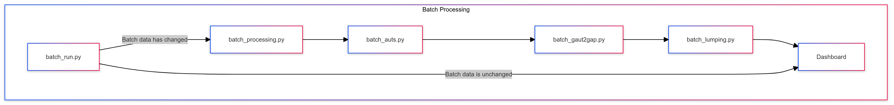

Dashboard users can toggle between 'User Uploaded Data' and 'Pre-loaded Data'. 

The 'Pre-loaded data' consists of processed network data that users can toggle between to demonstrate the operation of the dashboard. The processed data originates from network data associated with the paper “[Dimension-reduction of dynamics on real-world networks with symmetry](http://doi.org/10.1098/rspa.2021.0026).

This data is generated through running __batch_processing__.py, you can do this by running
 

`python -m dsdp-lumping batch`

::: dsdp-lumping.__batch_run__