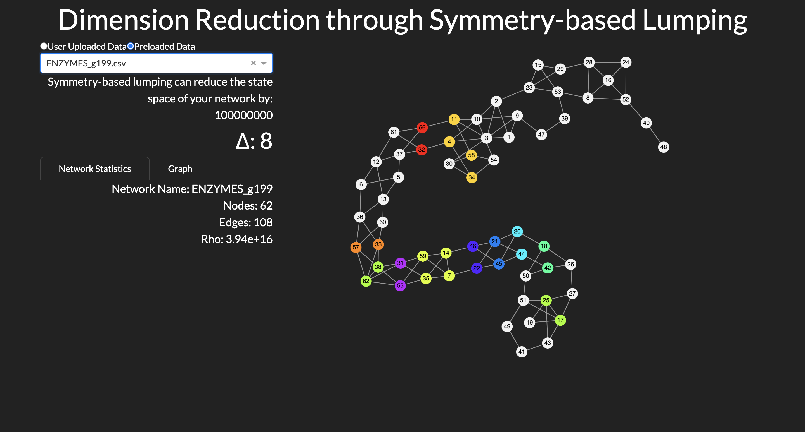

# Symmetry-Based Dimension Reduction of Network Dynamics

Real-world networks are often messy and complex, with large numbers of vertices and edges, high connectivity, and intricate structures. These networks can also be dynamic, with states changing over time. Understanding the behavior of these networks is crucial for interpreting the systems they represent, such as ecosystems, social networks, or the spread of diseases in populations.

## Project Overview

This project provides a visual and interactive implementation of a method developed by Dr. Jon Ward, as described in the paper “[Dimension-reduction of dynamics on real-world networks with symmetry](http://doi.org/10.1098/rspa.2021.0026),” published in *Proceedings of the Royal Society A* (2021). This method is particularly useful for studying complex dynamical processes on networks, where the full state-space would be too large to handle directly.

### Workflow

The implementation involves several key steps:

1. **Network Conversion**: Converting a given network into a format compatible with [Saucy](https://v4.cs.unm.edu/~saia/papers/saucy.html), a tool used to find network symmetries.
2. **Symmetry Detection**: Using [GAP](https://www.gap-system.org/) and [Gappy](https://github.com/gap-packages/gappy) to identify automorphisms within the network, which helps to understand its symmetrical structure.
3. **Data Collection and Analysis**: Gathering and analyzing information about the network and its reduced state space.
4. **Visualization**: Creating visual representations of the network and its symmetries using an interactive dashboard built with [Plotly Dash](https://plotly.com/dash/).

### Interactive Dashboard

The interactive dashboard allows users to:

- Explore network properties and symmetries.
- Visualize complex dynamics with intuitive visual tools.
- Interact with the data for deeper insights.

This makes it easier for users to explore and interpret the results of applying the dimension reduction method to their own complex network dynamics.

## Purpose

The project aims to make advanced theoretical concepts more accessible to a broader audience, including researchers and practitioners in various fields. By translating complex ideas into interactive visualizations and user-friendly explanations, the tool bridges the gap between theory and practice.

## Repository

The full implementation and source code are available on GitHub:

- [Symmetry-Based Dimension Reduction Repository](https://github.com/preetscient/symmetry-based-dimension-reduction)

## Acknowledgments

This project builds on the foundational work of Dr. Jon Ward and is supported by various open-source tools, including [GAP](https://www.gap-system.org/), [Gappy](https://github.com/gap-packages/gappy), [Saucy](https://v4.cs.unm.edu/~saia/papers/saucy.html), and [Plotly Dash](https://plotly.com/dash/).

---

Feel free to navigate through the documentation to learn more about the project and its applications!
